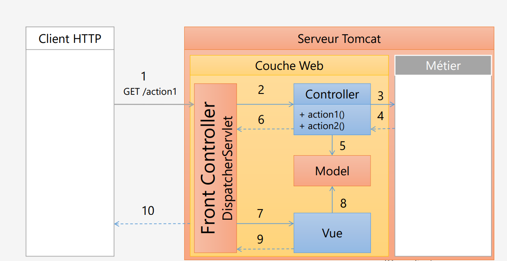
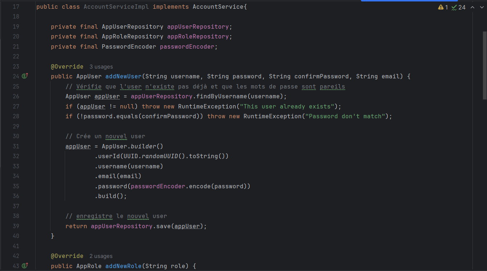

# Dévelopment Web JEE Spring MVC

### Introduction
Développement d'une application Web JEE basée sur Spring MVC,
Thylemeaf, Spring Data JPA et Spring Security qui permet de 
gérer les patients. 

L'application doit avoir les fonctionnalitées suivantes :
* Ajouter un patient
* Modifier un patient
* Supprimer un patient
* Rechercher un patient
* Gérer la pagination
* Gérer les droits d'accès
* Sécuriser l'application en intégrant un système d'authentification basé sur Spring security avec les trois stratégies:
* * InMemoryAuthentication
* * JDBC Authentication
* * UserDetailsService

### Architecture Spring MVC sans Spring Security

### Architecture Spring MVC avec Spring Security

### Sécurisation de l'application avec Spring Security

* Création de la classe SecurityConfig

La classe SecurityConfig est une classe dans Spring Security qui permet de configurer la sécurité de 
votre application web. Elle est souvent utilisée pour définir
des règles de sécurité, comme la gestion de l'authentification
et de l'autorisation des utilisateurs.

`Dans un projet avec Spring Security, c'est le point d'entrée des requetes. Comme
c'est illustré dans la deuxième captures ci-dessus.`

* `@Configuration` indique que cette classe est une classe de configuration Spring.
* `@EnableWebSecurity` active les fonctionnalités de sécurité web fournies par Spring Security.

`securityFilterChain(HttpSecurity http)`:

* Méthode principale pour configurer la sécurité HTTP.
* Vous pouvez définir ici quelles routes doivent être protégées et lesquelles sont accessibles publiquement (comme "/public/**" dans l'exemple)

`Authentification` :

* Ici, l'authentification se fait via un formulaire de connexion. Une page de connexion personnalisée est utilisée `(/login)`.

`Autorisation` :

* La méthode `authorizeRequests()` permet de définir des règles d'accès. Dans cet exemple, seules les requêtes vers les chemins `/public/**` sont autorisées sans authentification, alors que toutes les autres requêtes nécessitent une connexion.

### InMemoryAuthentication

- `Définition:` Cette stratégie d'authentification stocke les informations d'identification des utilisateurs en mémoire, généralement dans la configuration du code.

- `Différence:` Les détails des utilisateurs sont définis directement dans le code, et ils restent en mémoire pendant la durée de vie de l'application. Cette approche est souvent utilisée pour des utilisateurs statiques et dans des environnements de développement

### JDBC Authentication

- `Définition:` Cette stratégie d'authentification utilise une base de données relationnelle (comme MySQL, PostgreSQL, etc.) pour stocker et récupérer les informations d'identification des utilisateurs

- `Différence:` Les détails des utilisateurs sont stockés dans une base de données. Cela offre une solution plus évolutive pour la gestion des utilisateurs, particulièrement dans des environnements de production

Dans la base de données

### UserDetails Authentication

- `Définition:` Cette interface permet de récupérer les détails de l'utilisateur à partir de n'importe quelle source de données personnalisée, par exemple, une base de données NoSQL, un service web, etc.

- `Développement:` Dans cette stratégie, c'est au développeur de créer les tables, définir les repository, le service. Après cela il devra juste crée un service qui implémente userdetailsservice 

- `Différence:` Plutôt que de déclarer une stratégie d'authentification spécifique, cette approche permet de connecter un service personnalisé (UserDetailServiceImpl dans ce cas) qui implémente l'interface UserDetailsService. Cela offre une grande flexibilité pour récupérer les détails des utilisateurs à partir de diverses sources

1. Créer les entitées
   
   

2. Créer les repositories
   
   

3. Créer le service
   
   

4. Crée un service qui Implémente UserDetailsService
   

5. Appeller la méthode userservicedetails dans le filterchain
   

6. Ajouter des données factice pour le test
   

Dans la base de données

### Résultat

User Dashboard

Admin Dashboard

Search

Custom Login Page

Add Page

Edit Page

Delete Page

### Conclusion
Ce projet nous permis d'apprendre à utiliser Spring MVC, de mettre en
place Spring Security

